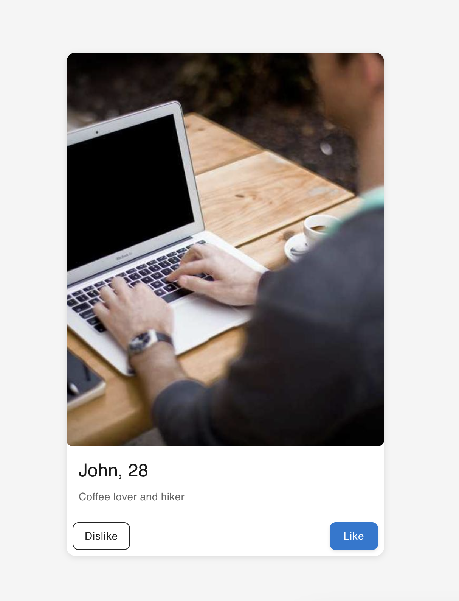
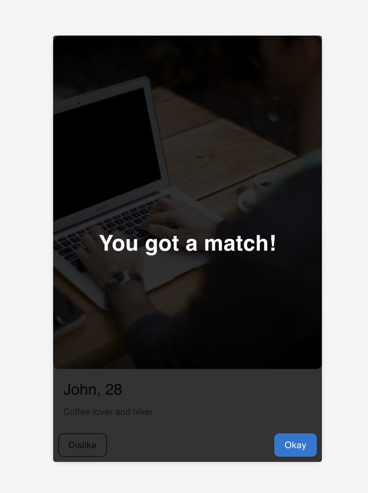
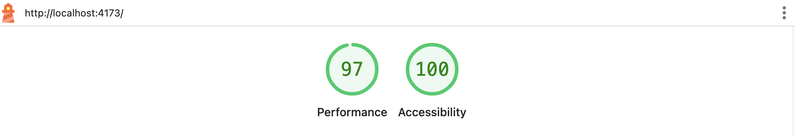
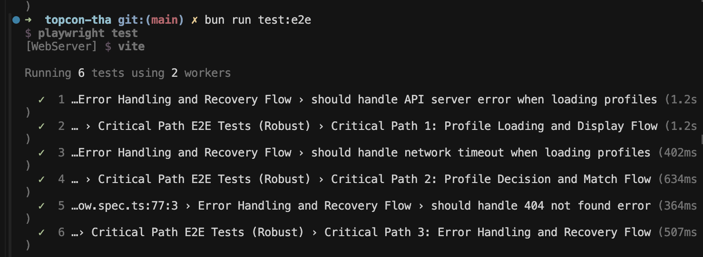
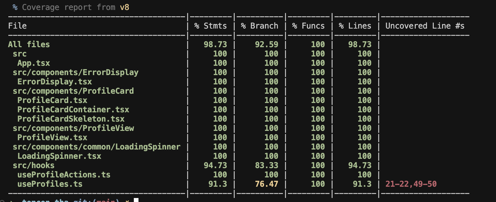

## Tinder-like Dating App Prototype

*TODO: Build a production-ready Tinder-like prototype with like/dislike functionality, real-time API integration, comprehensive testing, and modern UI/UX following React best practices*

[Giuliano De Ioanni](mailto:giulianodeioannigcp@gmail.com)

### [Click here to see the Video Review]([LINK_TO_LOOM_VIDEO])

## Proposed Solution

*TODO: A modern React-based dating app prototype with robust architecture, comprehensive testing, and production-ready deployment capabilities*

- **Frontend Architecture**: Built with React 19, TypeScript, and Vite for optimal development experience and build performance
- **UI Framework**: Implemented Material-UI (MUI) components for consistent, accessible, and modern design patterns
- **State Management**: Custom React hooks for profile management and user interactions with proper error handling
- **API Integration**: RESTful service layer with TypeScript interfaces matching the backend contract
- **Testing Strategy**: Comprehensive test suite with 100% coverage including unit tests (Vitest), and end-to-end tests (Playwright)
- **Error Handling**: Robust error boundaries, loading states, and user-friendly error messages
- **CI/CD Ready**: Environment-based configuration, build optimization, and deployment-ready structure

### [Click here to see the Live Demo]([LINK_TO_THE_DEPLOYED_APP])

## Screenshots

| Profile View | Match Notification |
|--------------|-------------------|
|  |  |

## Assumptions

*TODO: Key assumptions made during development*

- **Backend API**: Assumes a running backend server implementing the specified REST API contract
- **Environment Configuration**: Requires `VITE_API_BASE_URL` environment variable for API communication
- **Browser Support**: Modern browsers with ES2020+ support (Chrome, Firefox, Safari, Edge)
- **User Experience**: Users understand like/dislike mechanics similar to Tinder
- **Data Persistence**: Backend handles profile state and matching logic
- **Mobile Responsiveness**: Primary use case is mobile-first design

## Libraries / Tools Used

- **React 19** - Modern React with concurrent features
- **TypeScript** - Type-safe development
- **Vite** - Fast build tool and development server
- **Material-UI (MUI)** - React component library
- **Vitest** - Unit testing framework
- **Playwright** - End-to-end testing
- **Testing Library** - React component testing utilities
- **ESLint** - Code linting and quality
- **Husky** - Git hooks for code quality
- **Bun** - Package manager and runtime

## Setup

### Frontend Application

To install the dependencies run:

```bash
bun install
```

And to run the app:

```bash
bun run dev
```

### Backend Server

The project includes a local Express.js server to emulate the backend API. To run the server:

1. Navigate to the server directory:
   ```bash
   cd server
   ```

2. Install server dependencies:
   ```bash
   bun install
   ```

3. Start the server:
   ```bash
   bun run start
   ```

The server will start on `http://localhost:3001` and provides the following endpoints:
- `GET /profiles/next` - Get the next profile in the queue
- `POST /profiles/:id/decide` - Make a decision (like/dislike) on a profile
- `POST /profiles/reset` - Reset the profile queue
- `GET /health` - Health check endpoint

**Note**: Make sure to set `VITE_API_BASE_URL=http://localhost:3001` in your environment variables to connect the frontend to the local server.

## Running the tests



You can run the unit tests using:

```bash
bun run test
```

For test coverage:

```bash
bun run test:coverage
```

For end-to-end tests:

```bash
bun run test:e2e
```

### Test Screenshots

The application includes comprehensive end-to-end testing with visual verification:

| E2E Test Results | Unit Test Coverage |
|------------------|-------------------|
|  |  |


## Future Work

1. **Placeholder**: [Placeholder]

